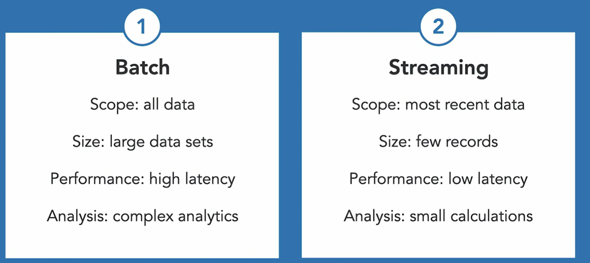
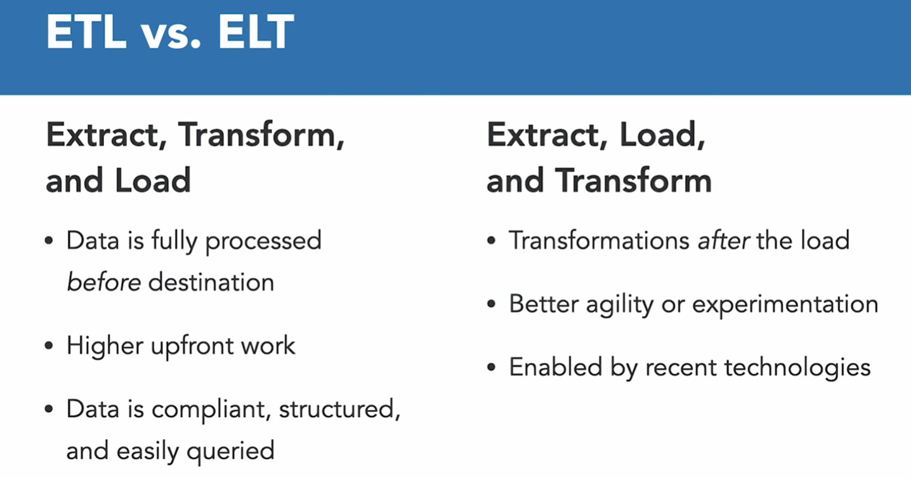

# Data Processing:

- Data processing is just a conversion of raw data into meaningful information, through a specific method after it has been ingested and collected.

2 Types:
1. Batch Processing
2. Stream Processing

## Batch Processing:

- In this processing mode, newly arriving data elements are collected into a group. The whole group is then processed at a future time, as a batch, when a certain condition is met
- **Conditions may include**: 
  - scheduled time intervals: salary processing,CC or utility bill etc.
  - event based processing: cpu utilization- optimizing utilization of servers
  - specific size or volume of data has arrived e.g., more volume is there on Black Friday etc. 

- Advantages: 
  - Process large amount of data
  - Process data at convinient times

- Disadvantages: 
  - high latency

  - example: for complex analytics, such as moving the data to a Data Warehouse for Business Intelligence operations

## Stream Processing:

- Processing data in real time mode as it arrives
- Useful for time critical operations requiring immediate responses.
- examples:
  - Sending telemetry data from a device from the edge. Device could be IoT device, mobile phone etc.

- Most organizations might require a combination of batch and stream processing for the day to day operations
- Stream processing is used for simpler, more reactive situations, or small calculations.

### Batch Processing Vs Stream Processing:

## Order of Data Processing:

- Data processing generally extracts the data from a source, transforms that into a format more suitable to work with, and loads it into a destination
-  Microsoft has ETL and ELT tools available both on premises, which is called **SQL Server Integration Services** or **SSIS**, and on the cloud, which is called Azure Data Factory
- Two approaches:
  - **ETL**: 
    - Extract, Transform, Load
    - Traditional Business Intelligence processes used ETL, which means extracting data from a source, usually a database, transforming it through operations such as filters, sorters, and lookups, and loading this data into a destination, generally a Data Warehouse.
    - data is fully processed before it is loaded into destination.
    - requires high upfront work to create Data Warehouse
    - once data is processed, we will have higher confidence that its compliant, well-structured, and easily queried.
    
  - **ELT**: 
    - Extract, Load, Transform
    - performs the transformations after the load by the destination system itself
    - provides more agility for your development team to change queries on the fly, in case the business needs change often
    - fulfuil our need to experiment with several different possibilities, a common occurrence on advanced analytics workloads
    - ELT only became feasible on more recent years, as storage became cheaper, and after the development of technologies such as **PolyBase**, **Data Lakes**, and **Massive Parallel Processing MPP systems, like Azure Synapse Analytics**.

