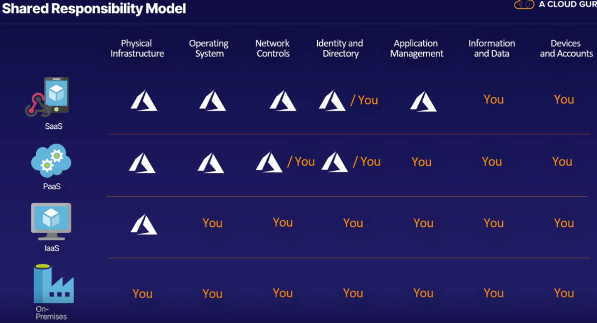

# Cloud Service Models:- On Premises, Iaas, pass, and Saas

### on-premises:
- This has been the option traditionally chosen before public clouds became widely available
- option for highly regulated industries that forbid cloud hosting
- you'll be responsible for everything, hardware, software, cabling, patching, backups, VMs, the storage, and so on
- Examples of on-premises technologies are SQL Server or a physical file server running Windows Server 2019.

### IAAS: Infrastructure-as-a-Service

- Refers to Actual Servers provided by Azure
- Scaling can be done on need basis
- Iass provides servers, storage and networking as a service
- Maintenance of server is done by Azure
- You purchase, configure your own software, OS, middleware and applications and do installation on host and maintain it.
- IAAS includes VM's, Networking, Storage, Firewall, and physical hardware everything runs on.

### PAAS: Platform-as-a-Service
- It is a superset of IaaS
- Apart from IAAS offering, **it will also offer Middleware and development tools, BI Services, database management Systems and more**
- PaaS is designed to support the complete web application lifecycle: building, testing, deploying, managing, and updating.
- So you just manage application that you develop and cloud Service provider does manage everything else which includes Security Features, data Warehouse Service, VM provisioning, Networking, etc. etc.
- example: Cosmos DB
- Azure SQL Managed Instance gives highest compatibility to on premise sql servers. 

### SAAS: Software-as-a-Service
- Its superset of both PASS and IASS
- **You don't own Software but just pay for usage**
- No maintenance to be done by you but taken care by respective Service Provider.
- Example: Microsoft 365, gmail for email , Azure SQL Server, Azure AD  etc.

### Serverless

- **You don't have to manage any servers**
- Azure Functions are probably the best-known examples of Serverless on Azure.
- Serverless architecture takes PaaS to the most extreme by fully abstracting away the server in such a way that a single function of code can be hosted, deployed, run, and managed without even having to maintain a full application.