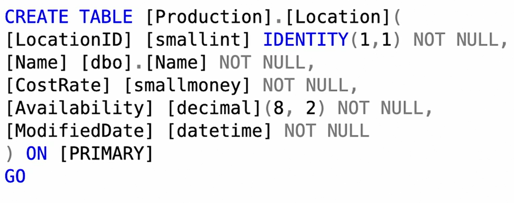
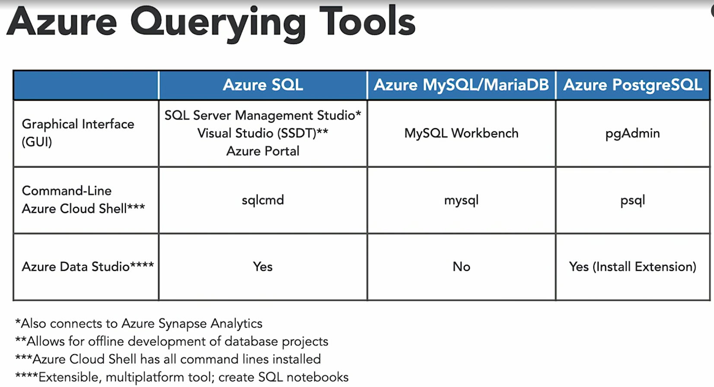

# Querying Relational Data

- SQL or structured query language was originally created in the 1970s as a way to query relational database
- By 1987, it had being made the standard by both ANSI and ISO and it has been the main language used by most relational database systems ever since.
- Vendors create their own dialects of the SQL language exchanging them with additional features. For example, SQL Server uses Transact-SQL, Oracle uses PL-SQL. Postgres SQL uses pgSQL and so on.
- Vendor specific dialects of SQL have additional features. 

## SQL Language Command Types:

### DML: Data manipulation Language 

- allow you to perform **CRUD operations on the data.**
- CRUD stands for create, read, update and delete.
- most commonly used commands is SELECT to retrieve data from a table
- **DML focuses on data** 
- common commands: 
  - SELECT, 
  - INSERT, 
  - UPDATE, 
  - DELETE
  - MERGE - merges(syncs) data
- Add WHERE clause to filter data
- Add JOIN to related tables : INNER JOIN, CROSS JOIN, FULL JOIN etc. 
- Add Functions for additional logic , example MAX used below: 

example: 
```sql
SELECT MAX(ListPrice) FROM Production.Product FULL  JOIN Production.ProductModel PM ON PM.ProductModelID = Product.ProductID WHERE color = 'Blue'
```

### DDL: Data Definition Language

- **these are used to create, update, delete  new objects in database** such as objects, tables, views, start procedures and functions
- common DDL commands:
  - CREATE
  - ALTER
  - RENAME
  - DROP

example:


**- DML focuses on objects compared to DDL which focuses on data.**

### DCL: Data Control Language

### TCL: Transaction Control Language


