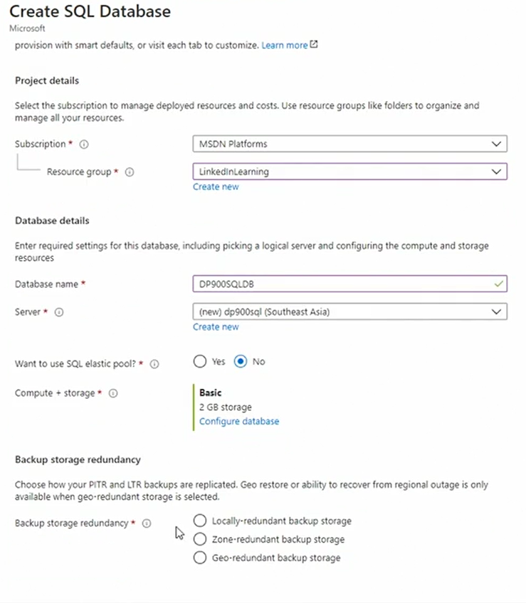

# Working with Azure Database

- go to Azure portal -> search for azure SQL -> 3 options for create
  - SQL db
  - SQL managed instance 
  - SQL VM .i.e, diff configuration of OS and SQL server Version
- 
- choose connectivity method
- choose firewall rules 
- click NExt and create

- Using Query editor we can run sql queries
- also we can use Azure Studio to run queries. its one of most popular tools to manager sql data on Azure
 