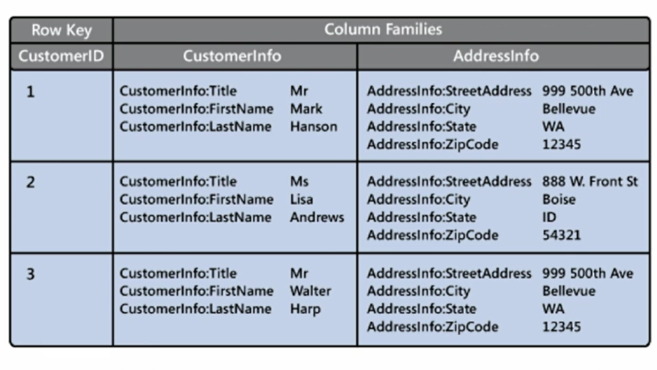
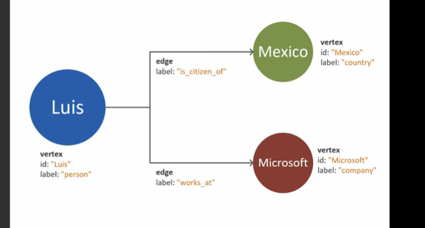

# Non-Relational Database Offering in Azure

- also called NoSQL databases
- **Types**: 
  - **key-value stores**,
    - simplest and fastest
    - each row can have any number of columns
    - can have any number of columns
    - each item is key-value pair
    - read and write data very quickly
    - **limitations**:
      - search only based on key
      - write operation is restricted to insert and delete
      - to update and item - retrive it, modify in memory, write back to db overwriting original db
      - **Azure Tables, Cosmos DB(Table API)**
 
  - **document databases**,
    - better than key-value store 
    - store data in json format
    - other formats- xml , yaml etc.
    - flexible schema - any number of columns 
    - more flexibility than relational database
    - can do search on values as well as key
    - support indexing for fast retrival
    - single document has all needed info while for same info in relational db we may have to query multiple tables
    - **limitations**: 
      - data repetitions may occur
      - more storage
      - not as fast as key-value but much better search
    - Cosmos Db(SQL API)
  - **column-family databases**,
    - similar to relational but here we can group logically related columns into column-families
    - 
    - retrieval of related info is much faster
    - As JSON is good example for document structure, parquet is good example for column-family. 
    - apache Cassandra, Cosmos DB(Cassandra API)
    - 
  - **graph databases**
    - use to model complex relationship
    - consists of nodes(info about objects) and edges( info about relationship)
    - 
    - edges can also have direction
    - goal of graph db is to perform queries which officially traverse this network of nodes and edges. 
    - fast analysis without nested joins and subqueries
    - example : Cosmos DB( Gremlin API)