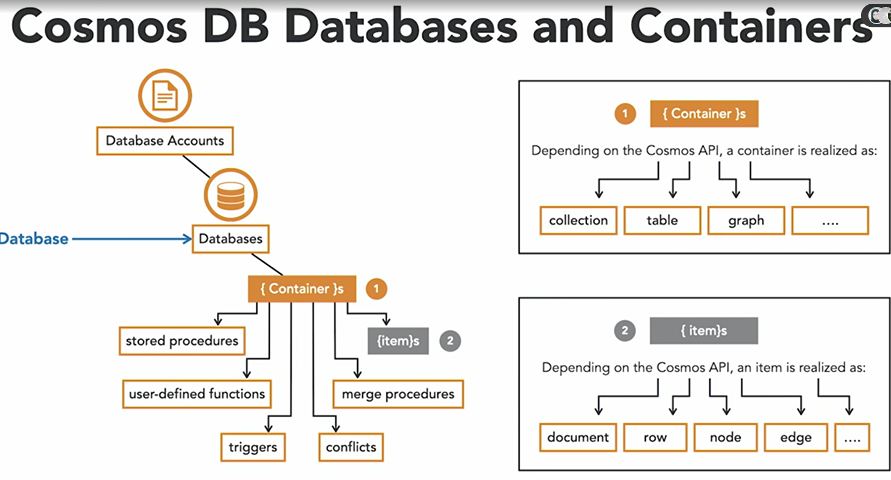

# Cosmos DB

- Azure Cosmos DB is the main Microsoft NoSQL database management system, storing data as JSON documents.
- It works on a Platform as a Service level, so several administrative tasks are managed for you.
- Cosmos DB is **multi-model**, which means that it supports documents, key-value pairs, graph and column-family data, depending on the API that you choose.
- It's also very fast, guaranteeing **less than 10 milliseconds latency** for both reads and writes 99% of the time. That's because the data is spread across partitions on several nodes.
- These makes Cosmos DB an excellent choice for IoT and telematics, gaming and the highly responsible mobile and web applications on a global scale
- Microsoft itself uses Cosmos DB on several of their mission-critical applications including Skype, Xbox, Office 365, and Azure
- capability of supporting multiple read replicas and write regions.
- 

## APIs supported by CosmosDB

### SQL API
- default native API
- supports SQL-like commands

### Gremlin API
- enables you to implement a graph database on Cosmos DB
- you can also query graph data as a JSON document using a SQL-like language

next three APIs are less focused on new projects but recommended instead when you're migrating from Azure Tables, MongoDB or Cassandra.

### Table API

- allows you to migrate your key value pairs from Azure Tables
- customers start with Azure Tables because of its low price, simplicity and high throughput

### MongoDB API
- allows to migrate from Mongo DB
- MongoDB is another very old established document database. But customers may decide to migrate to Cosmos, either because it fits their IT strategy or to leverage the PaaS-level capabilities of the product, including automated backups and indexing.

### Cassandra API
- recommended for migrations from a Apache Cassandra, which is another famous on-premises column-family database management system

## how Cosmos DB manage the data.

- The top level on Cosmos DB is a Cosmos DB account.
- We can have 50 accounts under azure subscription
- next we can have one or more databases under each of those accounts 
- under each database we have containers. 
- Containers are the units of scalability for both throughput and storage, which means that it's on the container level that you configure a Cosmos DB performance

- depending on which API you have configured for Cosmos DB Container will mean diffefnt things 
  - For Gremlin API -> Container Resource type would be graph
- Containers will not only host data items but also other database elements, such as triggers, stored procedures and functions
- items are the ones holding the data.
- it can even hold these small binary files up to two megabytes in size. If you need more than that, however, you can always create a reference to an external Azure Blob Storage
- the data type of the item will depend on which API you have configured for Cosmos
    - If you have configured the Gremlin API, for example, the items will be nodes and edges

## Cosmos DB Management Task

- **provisioning**
  - creation of the resource on Azure
  - Azure Portal, Azure CLI, Azure PowerShell, ARM templates
  - Provisioning cosmos db resource you need to define amount of resource allocatd for it in **Request Units per second**. RUs are also the billing unit of Cosmos DB
  - The minimum throughput is 400 RUs per second,
  - can configure Rus both at the database and the container levels

- **replication**
  - As Cosmos DB is a PaaS-level solution, both replication and failover, in case of a failure, happen automatically within a single region giving Cosmos DB a guaranteed high availability of 99.99%.
  - can always configure multi-master replication, which means that every node can write

-  Data Explorer, Cosmos DB Data Migration tool if you want to perform data migrations
- which is available in the Azure portal under your Cosmos DB resource.
- This is a downloadable tool available on GitHub.