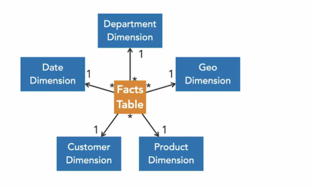

# analytics workloads

- analytical workloads is about transforming data into various insights 

## data processing solutions:

- OLTP
  - online transaction processing solution
  - for the day-to-day operations of a business
  - These kinds of systems record transactions, which are small in discrete units of work that needs to be executed or rolled back as a whole, example deposit in bank account etc.
  - follow ACID rules, which stand for atomicity, consistency, isolation, and durability
  - often associated with relational databases, such as SQL Server, Oracle, DB2, and so on
  - optimized for CRUD transactions, create, read, update and delete
  - 
- OLAP
  - online analytical processing
  - provide support for business intelligence or BI, which is a set of technologies, applications, and practices to support business decision making.
  - analytical systems must be optimized for read operations.
  - example: data warehousing solutions such as SQL Server Analysis services or Azure Synapse Analytics

## Data Modeling: 

- based on data processing solution OLTV or OLAP we decide how we will model out data
- OLTP:
  - works on normalized data
  - Normalization consist of distributing the data across several related tables to ensure data integrity and preventing data redundancy.
  - favours CRUD operaions
  
- OLAP: 
  - de-normalized model which decreases the number of table even if that incurs some data redundancy
  - because for analytics many tables need to be joined so de-normalized model is best suited

## Modeling Standard:

- Star Schema:
  - main modeling standard for business intelligence solution
  - 
  - On a star schema, you have a central facts table with data about something that happened, the sale of product, an ATM withdrawal, or the prescription for magical treatment.
  - Then you have dimension tables that describe what happened
  -  one-to-end operations between facts and dimensions
- Snowflake Schema
  - your dimensions are more normalized
  -  These decreases data repetition, but makes your models more complex