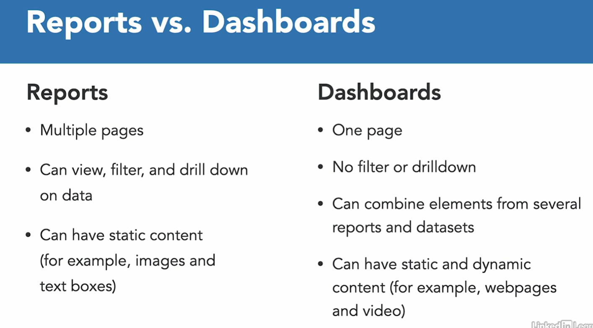

# MicroSoft PowerBI

- Power BI which wraps up all the Data work in beautifully designed reports and dashboards.

- **definition**: Power BI is a collection of software, service, apps and connectors that work together to create visually immersive Data visualization experiences.

## Data Visualization

- graphical representation of data and info
- uses visual elements such as charts, maps, graphs and tables to help you understand trends, anomalies, and patterns on Data.
- most popular Data visualization tool is Power BI.
- Power BI dashboard with a few elements to it
  - bar and column chart
  - line chart
  - pie and donut charts
  - Entry maps
  - maps

## Products in PowerBI

- Power BI Desktop
  - create the reports
- Power BI Pro service
  - Cloud-based service originally designed for viewing and sharing reports and dashboards.
- Power BI Mobile
  - view your reports on a mobile phone.

- It can get Data from over 130 different Data sources of various types such as files, online services, Databases and Datahouses and SAS applications.
- These Data can be combined on a single Data model for easier reporting.
- extremely flexible

## Definitions to know in PowerBI

- Datasets
  - collection of Data that Power BI will use to create the report 
  - Power BI Desktop has a very powerful tool for obtaining, treaching and cleansing the Data called Power Query which also allows to model server Data sources into a single Data model. This functionality is also available on the power BI service but there, it's called Data flows.

- Visulazitions:
  - visual representation of the Data sets such as line, bar or pie charts, tables and matrices and maps

- Reports 
  - collection of visuals grouped together into one or more pages.
  - The report is the unit of work that you will then publish into the power BI service to be viewed and shared by others.
- DashBoards
  - aggregations of one or more reports into a single page
    
- Apps
  - can combine dashboards and reports into
  - can be distributed internally or externally
  - 

